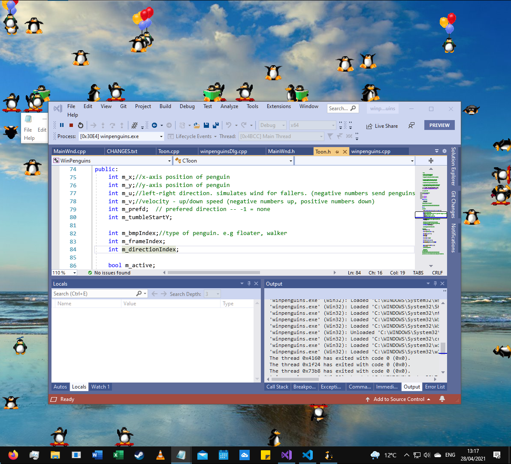

# WinPenguins

 Penguins wander around your desktop and engage in activities such as reading and skateboarding!

Screenshot of WinPenguins 1.0 running on Windows 10

## Requirements

* WinPenguins runs on Windows 10 and Windows 11.

## Downloads

Download and run WinPenguins from the Microsoft Store [here](https://www.microsoft.com/store/apps/9P5Z59BMZZ5G) 

## Usage

* Position the cursor or a window over a penguin to explode it.
* Position the cursor over balloons to pop them and cause the penguin to tumble! 
* Use the arrow keys or WASD keys to change the direction of Skateboarder Penguins.
* WinPenguins creates a penguin icon in the Taskbar Notification Area (located at the right end of the Windows Taskbar).  
   - Left click to access Settings.
   - To shutdown WinPenguins, right click to open the menu and click Exit.
   - To take a screenshot, right click to open the menu and click Screenshot... 

## Changes in WinPenguins 1.1
  - Fixed location of Explosion sprite when on edge of screen.
  - Improved error handling.
  - Small bug fixes.

## New features in WinPenguins Version 1.0:

  - WinPenguins now works on Windows 10 and Windows 11! (In Windows 8 and above, Desktop Window Manager (DWM) is always enabled which broke older versions of WinPenguins)
  - Added new Large penguins (Bitmaps from Xpenguins). Toggle between Small and Large penguins in Settings.
  - Added new Super Penguin (Bitmap from Xpenguins). 
  - Penguins can now walk upside down and skateboard upside down! (New sprites)
  - Penguins can now climb down and skateboard down. (New sprites)
  - Created new bitmap sprites for Large Santa Walker penguin and Large Santa Climber penguin.
  - Added new Exit animation for Walker penguins (Bitmap from Xpenguins).  
  - Created new bitmap masks for Skateboarder, Skateboarder Climber, Splat, and Exit sprites so they now work with Alpha blending.
  - Penguins now fall in through the top of the screen rather than materializing out of thin air!
  - Tumbling penguins can now transform into Skateboarder penguins on impact.
  - Balloons are now only popped for Ballooner penguins when mouse is over balloons area of sprite.
  - Smoother transitions between different penguin types.
  - Added DPI scaling support.  
  - Fixed a bug where sometimes the splat animation could be offset to the left or right instead of being central.
  - Fixed a bug where splat penguins would transform back to life on shutdown.
  - Fixed a bug where penguins would sometimes splat when transitioning from a Climber to a Walker. 
  - Fixed a bug where Tumbling penguins would only turn left on landing.
  - Fixed a bug where Reading penguins would read in mid-air in situations where there was no longer a window to sit on.
  - Fixed a bug where penguins could transform into Santa penguins even with Santa penguins disabled.
  - Fixed a bug where Climber and Skateboard Climber penguins would always tumble when hitting a top right corner.
  - Fixed a bug where a falling penguin would tumble instead of climbing when hitting side of window.
  - Fixed a bug where WinPenguins would sometimes not shutdown if a penguin was in the exploding state.
  - Fixed a bug with balloons not popping on mouse over.
  - Fixed a bug where screenshot would not be saved if the BMP bitmap file format was chosen.
  - Fixed an issue with sound clipping when multiple sounds are played at once.
  - Instead of drawing on the desktop window, penguins are now drawn on a new transparent overlay window.
  - Migrated from ANSI to Unicode.
  - Migrated to superior [Pseudorandom Number Generator library](https://github.com/effolkronium/random).
  - Removed winmon.dll dependency.
  - Removed old unused code.
  - Improved performance.
  - Fixed lots of resource and memory leaks.

## Building in Visual Studio 2022

* Clone the respository (git clone https://github.com/ricky65/WinPenguins.git).

* Open the Visual Studio solution winpenguins.sln in the root.

* Run WinPenguins: Ctrl + F5 or Debug > Start Without Debugging menu.

* Debug WinPenguins: F5 or Debug > Start Debugging menu.

* For a default debug x64 build, the winpenguins.exe binary is located in \x64\Debug.

## Acknowledgements

Thank you to Michael Vines for creating the original version of WinPenguins.

WinPenguins is a Windows API rewrite of the X-Windows application XPenguins. The XPenguins homepage is located at http://xpenguins.seul.org/, and was written by Robin Hogan.

The penguin images were taken from 'Pingus', a free lemmings clone for GNU/Linux (http://pingus.seul.org), and were designed by Joel Fauche. 

## Contributing

Pull requests are welcome. For major changes, please open an issue first to discuss what you would like to change.

## License

WinPenguins is released under the GNU General Public License. See the file [COPYING.txt](./COPYING.txt) for details